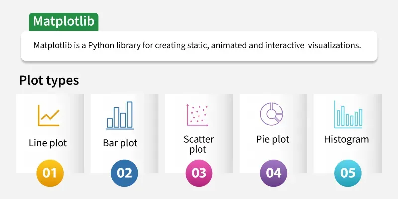

`Matplotlib` is a widely used Python library for creating static, interactive and animated visualizations from data.
Static in Matplotlib means the output is a fixed, non-interactive image — you cannot zoom, hover, or click on it after it's generated.

Plotting refers to creating a visual representation of data - a chart or graph drawn on axes (x, y) -  using libraries. 

**"Plot the sales data" = draw a graph of it.**

Plot types: 

Example: Let's create a simple line plot using Matplotlib, showcasing the ease with which you can visualize data.
```
import matplotlib.pyplot as plt

x = [0, 1, 2, 3, 4]
y = [0, 1, 4, 9, 16]
plt.plot(x, y)
plt.show()
```


`Plotly` — interactive charts for web/notebooks


### commands
install Matplotlib: `python3 -m pip install --user matplotlib`

if your Python is managed by Homebrew, it will blocks pip install to prevent breaking the system Python environment.

a solution for this problem :

create a virtual environnement (a folder that isolates my packages) :
```
python3 -m venv my-env                                                                                                                                                                                                          
source my-env/bin/activate                                                                                                                                                                                                      
pip install matplotlib
```
Important : you should run `source my-env/bin/activate` each time you open a new terminal to use this env.


## python example code to learn from 
a function can return multiple values at once, and you can assign them in a single line.

tuple unpacking :
```
def two_values():
    return 10, 20

a, b = two_values()                          
print(a)  # 10                          
print(b)  # 20
```